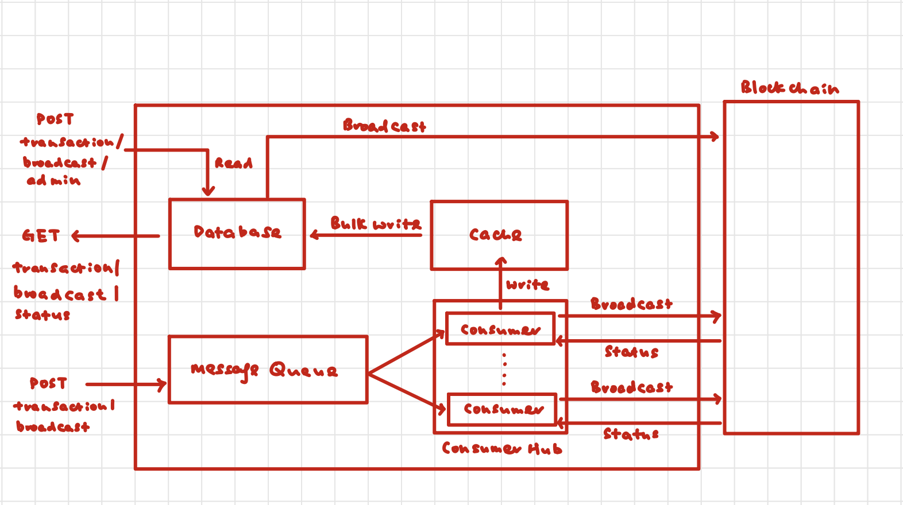

## Q3



### Message Queues

- The broadcaster service runs a message queue (eg Kafka, RabbitMQ) that contains all the transactions that is received from the internal endpoint. 

- When the post request is received, the broadcaster service parses information in the post request and stores it in a `Transaction` data type. Each transaction has a status (`Queued`, `Success`, `Failed`, `Pending`). When in the queue, the status will be `Queued`

- At the same time, the broadcaster service also runs a `ConsumerHub` on a goroutine. When the number of consumers is less than the max number of consumers, the `ConsumerHub` will create more consumers using goroutines.

- The consumers will then sign the transactions, make the rpc calls to the blockchain, and broadcast the transaction to the blockchain. After which, it will wait for the status of the blockchain transaction from the blockchain.

- By creating multiple goroutines to consume the transactions, we can leverage on concurrency to increase the throughput of the broadcaster service.

- Should the broadcast service crash, the transactions in the message queue is still persisted as it is written to the disk. Hence, when it restarts, the service will continue to broadcast the remaining messages on the queue.

### Retry Policy

- A max number of retries is set. If the blockchain receives a success code within 20-30 seconds, the status of the transaction will be set to `Success` and the goroutine will end. 

- When a failure code is obtained, the status of the transaction will be set to `Failed` and the transaction will be broadcasted again, up until the max number of entries is reached. 

- If no response is received within 30s, the goroutine will wait a little longer (eg 45s, or 1 min). If there is still no response, the status of the transaction will just be set to  `Pending`. In general, there should not be a re-broadcast of the transaction if the status is unknown. 

- However, there might be some specific scenarios in which it can be permitted. For example, if the transaction is idempotent (eg querying information from the blockchain) or if the transaction can only take place at-most once (eg transfer of ownership of nft, increase of allowance). In these scenarios, the retry policy will be the same as the failed transactions.

### Persistence (Cache + DB)

- All transactions that are consumed from the queue will be written to the cache. This is regardless of the status of the transaction.

- Once the cache reaches a certain size, the transactions will be written to the DB in bulk. Doing so reduces time taken to write the transactions to the DB, as compared to doing individual writes.

### List of transactions that passed or failed

- An endpoint will be exposed. It will only accept GET requests. Eg `GET /transaction/broadcast/status` When the endpoint is called, it will read from the DB and return the list of transactions. 
- Additional filters can be provided using request query strings or path parameters. Eg search for a specific transaction or filter for transactions within a certain time period.

### HTTP Status Code

- A HTTP status code of `200 OK` should be returned whenever a legitimate post request is received and the transaction is successfully added to the message queue.

- An error of `400 Bad Request` should be returned if an illegitimate request is made. Examples of such requests include those with missing data in the post requests. 

- There should be some retry mechanism in the event that the message queue producer is unable to add the transaction to the message queue. However, if the transaction is still not added to the queue after multiple tries, a error of `500 Internal Server Error` can be returned.

- I believe that a `HTTP 200 OK` response should not mean that the transaction will definitely be successful. It just means that the broadcast service will definitely broadcast it and the transaction will definitely successfully reach the blockchain, but it can still fail on the blockchain.

- However, it is not clear if the HTTP status code requirement is for the status code to reflect if the transaction is going to be successful on the blockchain. If it is so, one way to go about doing it is to keep HTTP connection alive until a response is obtained. However, given that the time required to obtain a response from the blockchain can be long, especially with the retry policy, this approach might take up previous resources, affecting the performance of the broadcast service.


### Admin

- One way for the admin to be able to retry a failed broadcast is to create another endpoint `POST /transaction/broadcast/admin`. A bearer token can be used for authentication of the admin. 

- The uuid of the failed transaction can be obtained from the `GET /transaction/broadcast/status`. 

- The relevant transaction data will then be fetched from the DB, and the broadcast can be retried.

### Pros of such a system design:
- The use of a message queue enables decoupling between receiving the transaction broadcast request and processing the request.
- In addition, as the queue is written to the disk, it allows for the transaction request information to be persisted and crash-resistant.
- By spinning up goroutines/ threads to consume from the queue, this allows for multiple consumers to be created and hence increasing the throughput.
- Scalability: If scalability needs to be improved, the POST endpoint can be on a reverse proxy server, where the traffic can then be routed to multiple other server nodes, which can then have their own queue and process the transactions.
- Correctness: It is crucial that transactions whose completion status is unknown is not re-broadcasted. Otherwise, this can result in repeated transactions, which might not be intended and can cause potentially distrastrious effects. Eg transferring coins twice.

### Cons of such a system design:
- If the system is run on a single node (ie the POST endpoint and the message queue is on the same node), the failure of the node can result in a total loss of service for the client.
- But this can be overcome by using a reverse proxy and deploying multiple other servers with their own message queues such that the failure of one server will not result in a loss of service. 


### Some relevant Data Structures
```
type Transaction struct {
    MessageType string `json:"message_type" validate:"required"`
    Data        string `json:"data" validate:"required"`
    Status      string `json:"status,omitempty" validate:"required"`
}
```

```
type ConsumerHub struct{
  maxNumConsumer int
  currentNumConsumer int
  maxRetries int
  mu sync.Mutex
}

// Create new consumer
func NewConsumerHub(maxNumConsumer int) *ConsumerHub {
  return &ConsumerHub{
    maxNumConsumer: maxNumConsumer,
  }
}

func (c *ConsumerHub) Run() {
  for {
    if c.currentNumConsumer < c.maxNumConsumer {
      go c.Consume()
    }
  }
}

func (c *ConsumerHub) Consume() {
  c.mu.Lock()
  c.currentNumConsumer++
  c.mu.Unlock()
  // create new consumer and consume transaction from the message queue
  // consumer will sign the transaction and make the rpc call to theblockchain
  // listen for the transaction status from the blockchain
  // retry is needed

  c.mu.Lock()
  c.currentNumConsumer--
  c.mu.Unlock()
}
```
